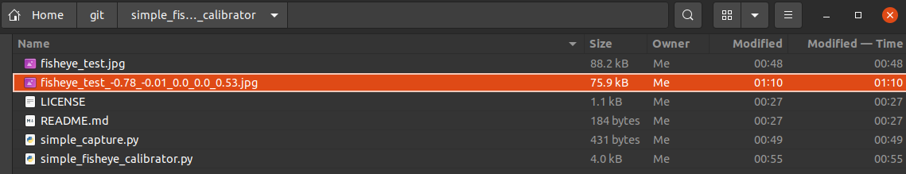

# simple_fisheye_calibrator
Simple GUI-based correction of fisheye images. The correction parameters specified on the screen can be diverted to opencv's fisheye correction parameters.


- Fisheye image before calibration




- (Sample) Fisheye image after calibration


## 1. Install
```bash
$ pip3 install -U simple_fisheye_calibrator
```

## 2. Usage
```bash
$ sudo pip3 install cvui Pillow opencv_python numpy --upgrade
$ git clone https://github.com/PINTO0309/simple_fisheye_calibrator.git && \
cd simple_fisheye_calibrator

$ python3 simple_capture.py

# 1. Capture one test image from the USB camera with "c" on the keyboard
# 2. Exit the capture application with "q" on the keyboard

$ python3 simple_fisheye_calibrator.py
```

## 3. Parameter
```
usage: simple_fisheye_calibrator.py
[-h]
[--file_path FILE_PATH]
[--window_size_width WINDOW_SIZE_WIDTH]
[--window_size_height WINDOW_SIZE_HEIGHT]

optional arguments:
  -h, --help show this help message and exit
  --file_path FILE_PATH
  --window_size_width WINDOW_SIZE_WIDTH
  --window_size_height WINDOW_SIZE_HEIGHT
```
